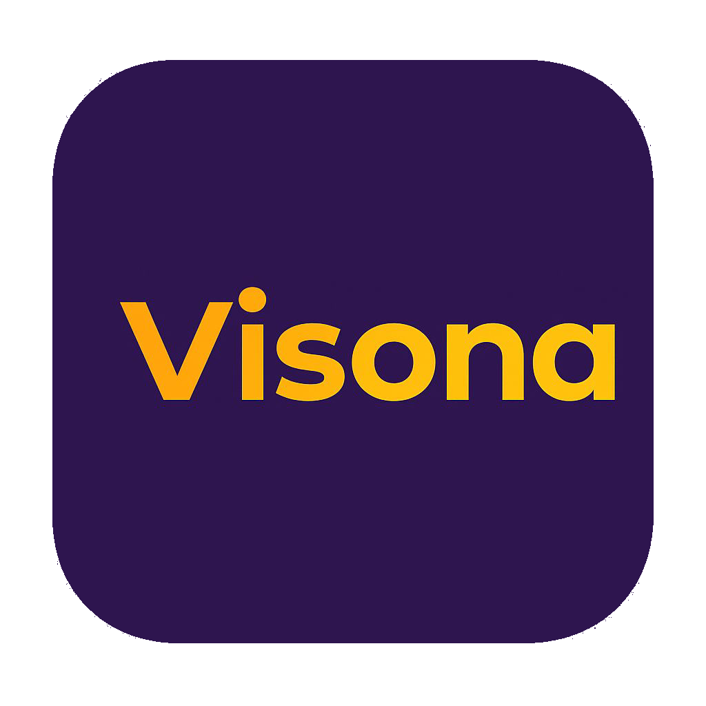
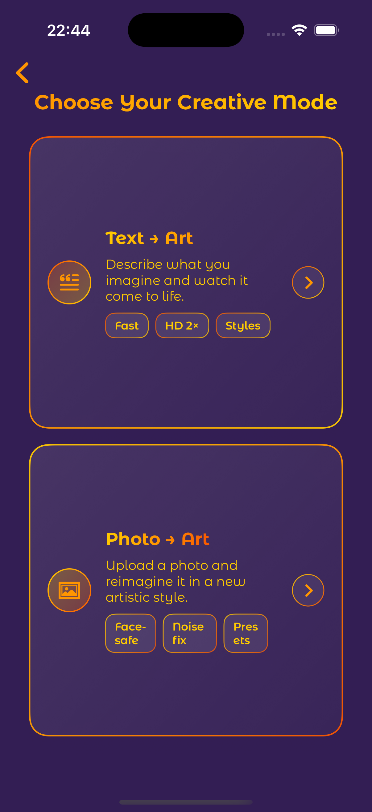
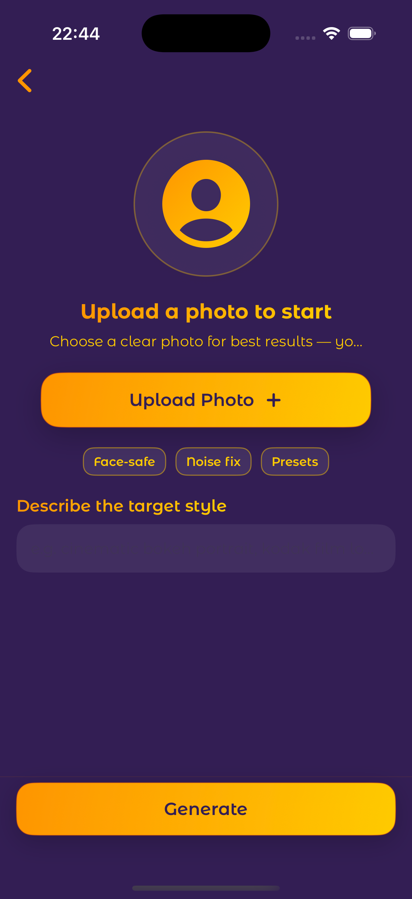
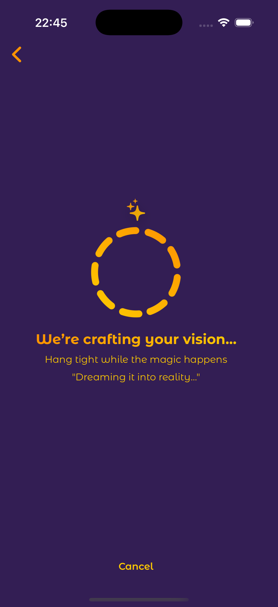
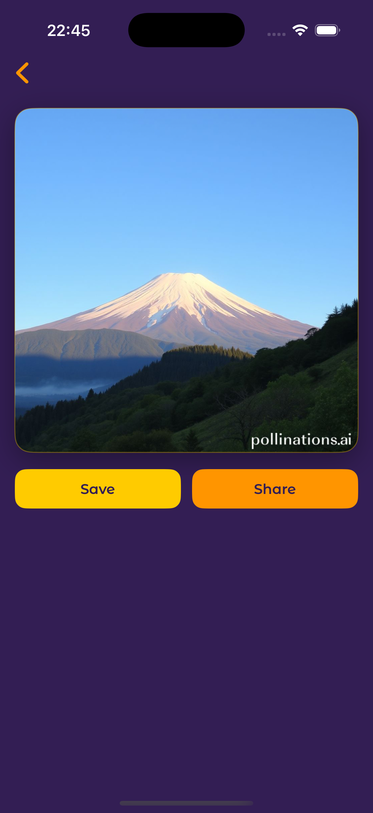
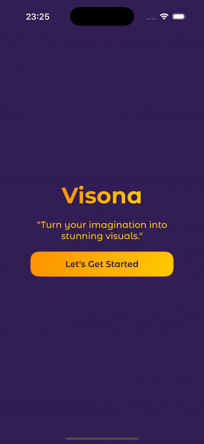

# 🎨 Visona – Art Generator powered by AI

Visona is an elegant **AI-powered image generation app** built for iOS using **SwiftUI** and **modern Apple frameworks**.  
It turns your imagination into **stunning visuals** — simply describe what you dream of, and Visona brings it to life ✨  

  

---

## 🌌 About the App

Visona blends **creativity and artificial intelligence** into a seamless user experience.  
You can:
- Generate AI-powered images from text prompts (Text → Art)
- Reimagine your own photos with new artistic styles (Photo → Art)
- Choose from a variety of curated art styles (Anime, Cinematic, Oil Paint, Neon, etc.)
- Save and share your generated artworks instantly
-  Use **Local Stable Diffusion** for offline image generation
- Enjoy a beautifully animated onboarding and splash experience
- Navigate through a minimalist, gradient-based dark theme interface

---

## 🧠 Technical Details

| Feature | Technology |
|----------|-------------|
| UI Framework | SwiftUI |
| Architecture | MVVM |
| Networking | Pollinations API (free & open AI image generation) |
| Local Photo Editing | PhotosUI & UIKit Integration |
| State Management | @State & @ObservedObject |
| Animations | Custom SwiftUI transitions & spring effects |
| Design System | Custom palette with Indigo / Amber / Orange gradients |
| Font | MontserratAlternates (default across all screens) |
| Backend | None (local client-side AI requests via Pollinations) |

---

## 🪄 Key Features

- 🎨 **AI Text-to-Art Generator:** Describe your vision and let Visona create it.  
- 🖼️ **Photo-to-Art Transformation:** Upload photos and reimagine them with creative filters.  
- 💫 **Stylized Gradients:** Consistent, vibrant color palette with smooth transitions.  
- 🧭 **Elegant Navigation Flow:** Splash → Mode Selection → Generator → Result View.  
- 🌙 **Dark Themed UI:** Designed for creative focus and comfort.  
- 💾 **Local Save & Share:** Save your creations to the device or share instantly.

---

## 📸 Screenshots

  
  
  
  
  
  

---

## 🎞️ App in Action

  

---

## 🧩 Design System

Visona uses a **custom centralized design system** defined in `DesignSystem.swift`, ensuring consistent colors, gradients, and typography.

| Element | Description |
|----------|-------------|
| 🎨 **Colors** | `vIndigo`, `vOrange`, `vAmber`, `vOrangeDark` |
| 🌈 **Gradient** | `LinearGradient.vCTA` — main call-to-action gradient |
| 🖋️ **Font** | `.montserrat()` extension (MontserratAlternates as default font) |
| 🧱 **Buttons** | `VPrimaryButton` component for shared button design |

---

## 🧠 AI Engine (Pollinations API)

Visona uses the **Pollinations API**, a free AI image generator, to transform text prompts into art.

- Endpoint: `https://image.pollinations.ai/prompt/<your_prompt>`
- No API key required — lightweight and open
- Returns dynamically generated artwork based on prompt context

## 👨‍💻 Author

**Batuhan Küçükaydın**  
Software Engineer | Computer Engineer | iOS Developer  
📫 [LinkedIn](https://linkedin.com/in/batuhankucukaydin) • [GitHub](https://github.com/batukucukaydin) • [Medium](https://medium.com/@batukucukaydin)

## ⭐️ Support

If you like this project, please consider giving it a star 🌟  
It really helps me keep building and improving!

## 📄 License
This project is released under the MIT License.
